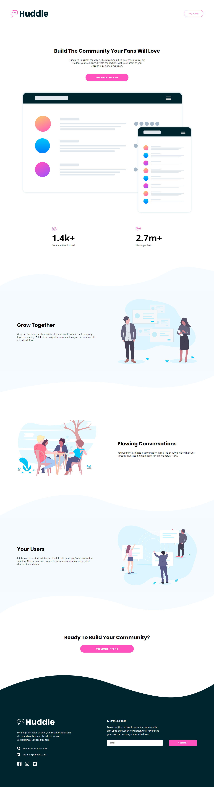
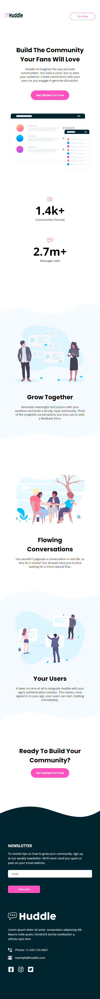
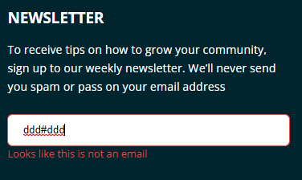
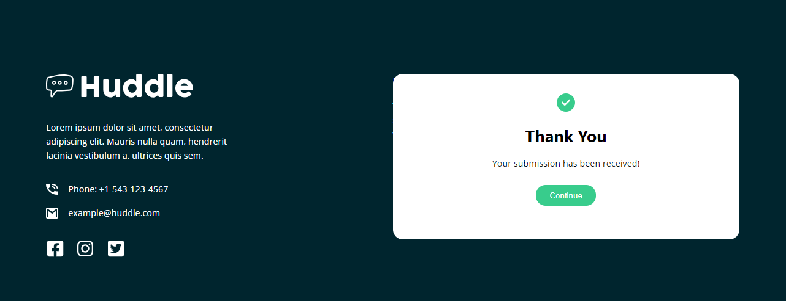

# Frontend Mentor - Huddle landing page with curved sections solution

This is a solution to the [Huddle landing page with curved sections challenge on Frontend Mentor](https://www.frontendmentor.io/challenges/huddle-landing-page-with-curved-sections-5ca5ecd01e82137ec91a50f2).

## Table of contents

- [Overview](#overview)
  - [The challenge](#the-challenge)
  - [Screenshot](#screenshot)
  - [Links](#links)
- [My process](#my-process)
  - [Built with](#built-with)
  - [What I learned](#what-i-learned)
  - [Useful resources](#useful-resources)
- [Author](#author)

## Overview


### The challenge

Users should be able to:

- View the optimal layout for the site depending on their device's screen size
- See hover states for all interactive elements on the page

### Screenshot






### Links

- Solution URL: [Add solution URL here](https://your-solution-url.com)
- Live Site URL: [Add live site URL here](https://your-live-site-url.com)

## My process

### Built with

- Semantic HTML5 markup
- CSS custom properties
- Flexbox
- CSS Grid

### What I learned

To see how you can add code snippets, see below:

```html
<picture>
  <source
    media="(min-width: 500px)"
    srcset="images/bg-section-top-desktop-1.svg"
  />
  <source
    media="(max-width: 501px)"
    srcset="images/bg-section-top-mobile-1.svg"
  />
  
</picture>
``` 
```css 
.imageContainer {
    order: -1;
  }
```

```js
if (!email) {
    errorMessage.style.display = "block";
    emailContainer.style.outline = '1px solid hsl(0, 100%, 63%)'
  } else if (!/^[^\s@]+@[^\s@]+\.[^\s@]+$/.test(email)) {
    errorMessage.style.display = "block";
    emailContainer.style.outline = '1px solid hsl(0, 100%, 63%)'
  } else {
    // Email is valid
    successMessage.style.display = "block";
  }
```


### Useful resources

- [ Easy waves, angles, & other creative shapes with CSS](https://www.youtube.com/watch?v=hWGgw1K-i8Y&list=LL&index=2) - This helped me for learning section curves in CSS.
- [Font Awesome](https://fontawesome.com/) - I used this website to download social icons.


## Author
- Website - [Tasnim Alam](https://github.com/Tasnim005)
- Frontend Mentor - [Tasnim005](https://www.frontendmentor.io/profile/Tasnim005)
